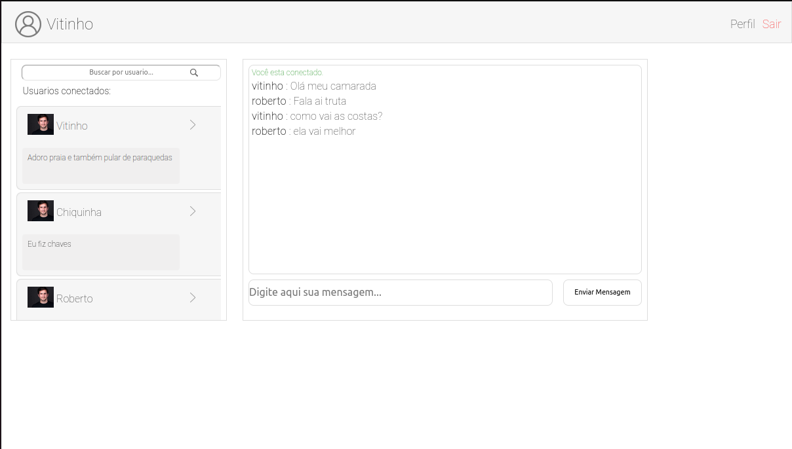

# front-end-chat

# Sobre

<h3>Um bate-papo para todas pessoas passarem seu tempo e interagirem com diversas outras pessoas conectadas simultaneamente.</h3>
<br/>

<h3>O projeto utiliza do framework Vue.js, o objetivo e consumir a aplicação do back end.</h3>


O lado do servidor foi construido através do Vue.js, você pode ver <a href="https://github.com/vitinhos67/online_chat-back-end">aqui</a>





Os usuarios são carregados atraves de uma Endpoint dispobilinizada pelo server-side, em que o mesmo guarda as informações no Redis

As mensagem são renderizadas e antes mesmo são inseridas no banco de dados, utilizando o axios para fazer as requisições.


## Project setup

```
npm install
```

### Compiles and hot-reloads for development

```
npm run serve
```

### Compiles and minifies for production

```
npm run build
```

### Lints and fixes files

```
npm run lint
```

